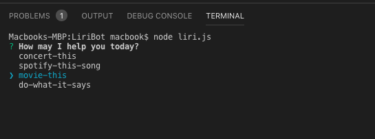

# LiriBot
# LIRI BOT:

 LIRI is like iPhone's SIRI. However, while SIRI is a Speech Interpretation and Recognition Interface, LIRI is a Language Interpretation and Recognition Interface. LIRI will be a command line node app that takes in parameters and gives you back data.

Once you type node liri.js you are able to select from on of the following commands:
  - concert-this
  - spotify-this-song
  - movie-this
  - Do-what-it-says
Once you choose the command LIRI prompts you enter a search value.
	-	Enter a band for concert-this
  - Enter a song
  - Enter a Movie name
  - Do not enter any search value for Do-what-it-says

## What Each Command Should Do:

### node liri.js concert-this <artist/band name here>
This will show the following information about the song in your terminal/bash window
  - Name of the venue
  - Venue location
  - Date of the Event
### node liri.js spotify-this-song '<song name here>'
This will show the following information about the song in your terminal/bash window
Artist(s)
  - The song's name
  - A preview link of the song from Spotify
  - The album that the song is from
If no song is provided then your program will default to "The Sign" by Ace of Base.
  
### node liri.js movie-this '<movie name here>'
This will output the following information to your terminal/bash window: 
Title of the movie.
  - Year the movie came out. 
  - IMDB Rating of the movie.
  - Rotten Tomatoes Rating of the movie.
  - Country where the movie was produced
  - Language of the movie.
  - Plot of the movie.
  - Actors in the movie.
If the user doesn't type a movie in, the program will output data for the movie 'Mr. Nobody.'

### node liri.js do-what-it-says
LIRI will take the text inside of random.txt and then use it to call one of LIRI's commands.
It will run the ‘spotify-this-song’ comand for "I Want it That Way," as follows the text in random.txt.
The file random.txt may be updated to run different commands/search value combinations.

## Getting Started
These instructions will get you a copy of the project up and running on your local machine for development and testing purposes. See deployment for notes on how to deploy the project on a live system.
Prerequisites
You will need to have npm installed on your system. 
Type npm -v to verify your system has npm.
If you don’t have npm then download it from https://www.npmjs.com/get-npm. 
You get a  spotify API key and secret from https://www.npmjs.com/package/node-spotify-api 

